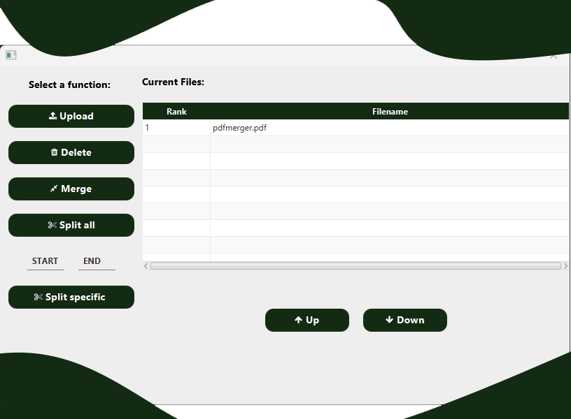

# PDFEditor



## About

PDFEditor is a simple Java-based application that allows users to edit PDF files quickly and efficiently. It provides basic functionalities for modifying existing PDFs, making it a useful tool for quick PDF document adjustments.

This project is built with Java and Maven for dependency management.

## Features

- Open and display PDF files
- Edit text within PDFs
- Save changes to new or existing PDF documents
- Simple and user-friendly interface

## Technologies Used

- Java
- Maven
- JavaFX (for GUI)
- [PDFBox](https://pdfbox.apache.org/) (for PDF manipulation)

## Getting Started

### Prerequisites

- Java 17 or higher
- Maven installed

### Installation

1. Clone the repository:
   
```bash
   git clone https://github.com/Yannick-Apostel/PDFEditor.git
   cd PDFEditor
```
2. Build the project with Maven:     
```bash
   mvn clean install
```

3. Run the application:     
```bash
   mvn javafx:run
```

Made with ❤️
